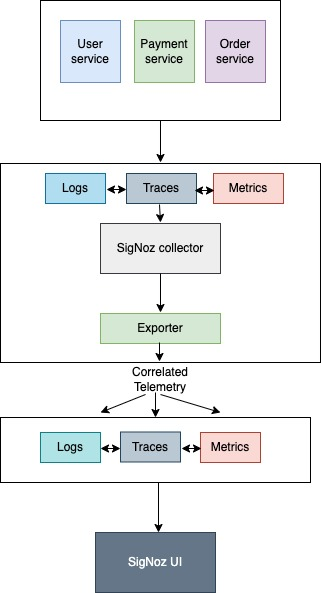

# golang-logging-instrumentation
Application which adds context information in logger

This project demonstrates how to instrument distrubted tracing in golang application with the help of below microservices:

- order-service
- payment-service
- user-service

For this you would need the following:

- Go (version = 1.18): For installation see [getting started](https://go.dev/doc/install)
- Mongodb: Download the Mongodb community version from [here](https://www.mongodb.com/try/download/community)
- `serve` for the frontend. For installation see: [https://www.npmjs.com/package/serve](https://www.npmjs.com/package/serve)
- [Signoz](https://signoz.io/)

## Tracing and Logging flow



## Running the code

In order to add the trace context information such as traceID, spanID and traceFlags in the logs, we have implemented a logger wrapper that records zap log messages as events on the existing span that must be passed in a context.Context as a first argument. It does not add anything to the logs if the context does not contain a span.

## Usage

```
log "github.com/vaish1707/golang-logging-instrumentation/logger"

log.Ctx(r.Context()).Info("message", []zap.Field)
```


With the integration this wrapper with the zap library, this is how our logs looks like(with traceid, spanid and traceflags).This follows the [log data model](https://opentelemetry.io/docs/reference/specification/logs/data-model/) from opentelemetry. For comparison purpose have posted the logs with and without integration of this wrapper.

**Before Integration:**

```jsx
{

	"hostname": "baschidbs02-1-p.broadsoft.ims.comcast.net",
	
	"level": "info",
	
	"line": "order/order.go:48",
	
	"requestId": "42b2b58d-e9bb-482a-89cf-3a8ab3e3d027",
	
	"requestMethod": "POST",
	
	"message": "Successfully completed order request",
	
	"time":"2022-12-26T21:33:45",
	
	"requestPath": "/orders",
	
	"userAgent": "Mozilla/5.0 (Macintosh; Intel Mac OS X 10_15_7) AppleWebKit/537.36 (KHTML, like Gecko) Chrome/108.0.0.0 Safari/537.36",
	
	"userId": "4538"

}
```

**After Integration:**

```jsx
{

	"hostname": "baschidbs02-1-p.broadsoft.ims.comcast.net",
	
	"level": "info",
	
	"line": "order/order.go:48",
	
	"requestId": "42b2b58d-e9bb-482a-89cf-3a8ab3e3d027",
	
	"requestMethod": "POST",
	
	"message": "Successfully completed order request",
	
	"time":"2022-12-26T21:33:45",
	
	"requestPath": "/orders",
	
	"spanid": "da0bace5360a7303",
	
	"traceid": "26a4a41da8170e6ee2bde8222056641b",
	
	"traceflags": 1,
	
	"userAgent": "Mozilla/5.0 (Macintosh; Intel Mac OS X 10_15_7) AppleWebKit/537.36 (KHTML, like Gecko) Chrome/108.0.0.0 Safari/537.36",
	
	"userId": "4538"
	
}
```

Configuration for microservices can be updated in .env file

```
# service config
USER_URL=localhost:8080
PAYMENT_URL=localhost:8081
ORDER_URL=localhost:8082

# database config
MONGO_DB_URL=<mongo_db_url>

# telemetry config
OTEL_EXPORTER_OTLP_ENDPOINT=localhost:4317
INSECURE_MODE=true
```

Start individual microservices using below commands

1. User Service

```sh
go run ./users
```

2. Payment Service

```sh
go run ./payment
```

3. Order Service

```sh
go run ./order
```

Start the frontend using following command. For installation of `serve` see: [https://www.npmjs.com/package/serve](https://www.npmjs.com/package/serve)

```sh
serve -l 5000 frontend
```

View traces and metrics at http://localhost:3301/
